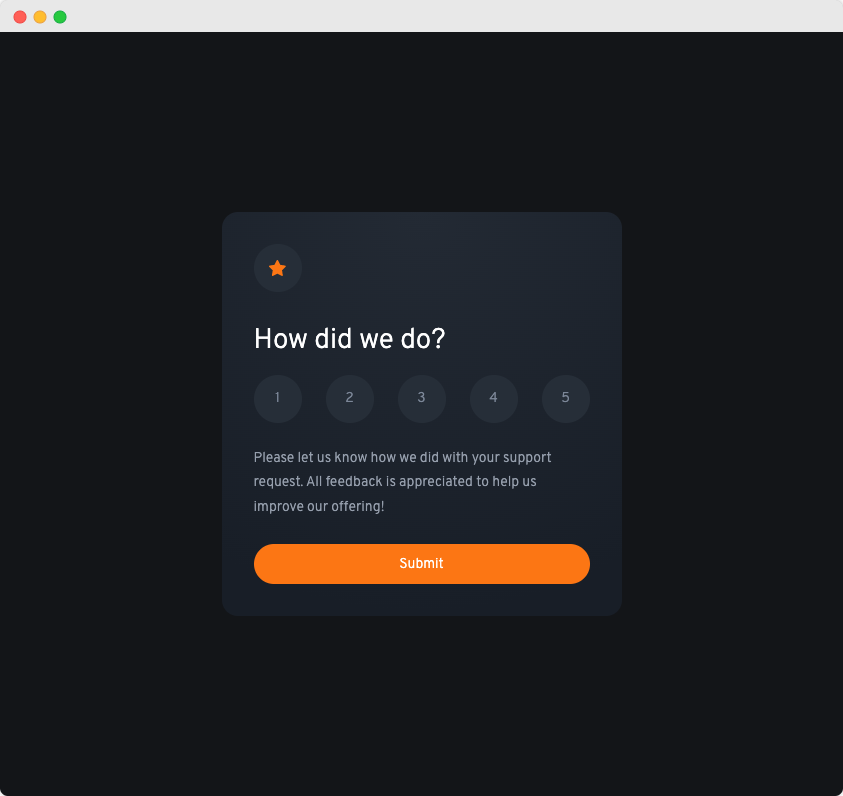

# FrontendMentor Challenge | Interactive Rating Component

This is a challenge from FrontendMentor.   
You can find the description of the task here:   
[frontendmentor.io](https://www.frontendmentor.io/challenges/interactive-rating-component-koxpeBUmI)



My goal in this challenge was to:
- Make use of a lottie in NextJS

### How to run
```bash
git clone https://github.com/jeromehaas/interactive-rating-component-fm
cd interactive-rating-component-fm
nvm use
npm install 
npm start
```